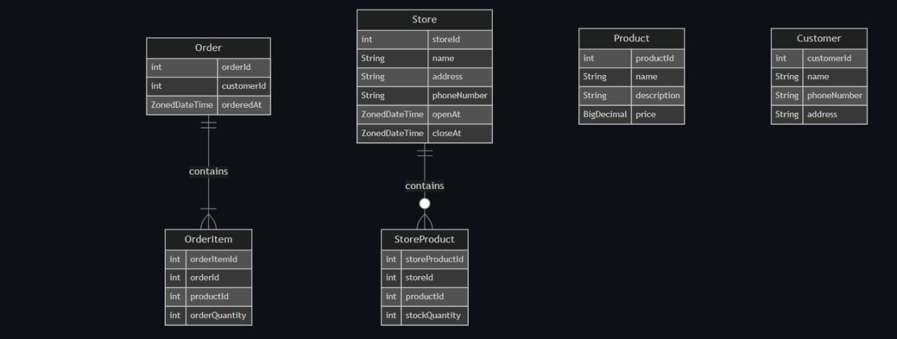

# ☕ Coffee Order Backend

스타벅스 사이렌 오더 스타일의 커피 주문 시스템을 스프링부트로 구현한 백엔드 프로젝트입니다.  
고객 등록부터 매장별 재고 관리, 주문 처리까지 실제 서비스 흐름을 반영하여 설계하였습니다.

---

## 📚 프로젝트 개요

> 사용자는 특정 매장에 있는 재고를 기반으로 다양한 상품을 주문할 수 있습니다.  
> 주문이 성공하면 재고가 감소하며, 재고가 부족할 경우 주문이 실패합니다.

---

## 🧩 도메인 설명

### 📦 주문 (Order)
- 고객은 하나 이상의 상품을 특정 매장에서 주문해야 함
- 상품마다 원하는 수량 지정 가능
- 주문 시 재고가 모두 충분해야 성공

### 🙋 고객 (Customer)
- 주문하려면 반드시 사전 회원가입 필요
- 필수 정보: 이름, 주소, 전화번호

### 🏪 매장 (Store)
- 이름, 주소, 전화번호, 오픈시간, 종료시간 필수
- 주문은 특정 매장에서만 가능

### 🛍️ 상품 (Product)
- 상품명, 설명, 가격이 필요
- 등록된 상품은 매장별 재고로 관리

### 🏷️ 매장 상품 재고 (StoreProduct)
- 매장별로 어떤 상품을 몇 개 보유하고 있는지 관리
- 주문 시 재고를 차감하고, 부족하면 주문 거부

---

## 🔧 기술 스택

| 분류        | 사용 기술                   |
|-------------|-----------------------------|
| Language    | Java 17                     |
| Framework   | Spring Boot 3.x             |
| ORM         | Spring Data JPA             |
| Build Tool  | Gradle (Kotlin DSL)         |
| DB          | H2 / MySQL                  |
| 기타        | Lombok, MapStruct 등 사용   |

---

## 🗃️ ERD

 <!-- image.png는 프로젝트 루트에 저장하세요 -->

---

## ▶️ 실행 방법

```bash
# 1. GitHub에서 프로젝트 클론
git clone https://github.com/husanboy-git/coffee-order.git
cd coffee-order

# 2. 실행 (H2 사용 시)
./gradlew bootRun
